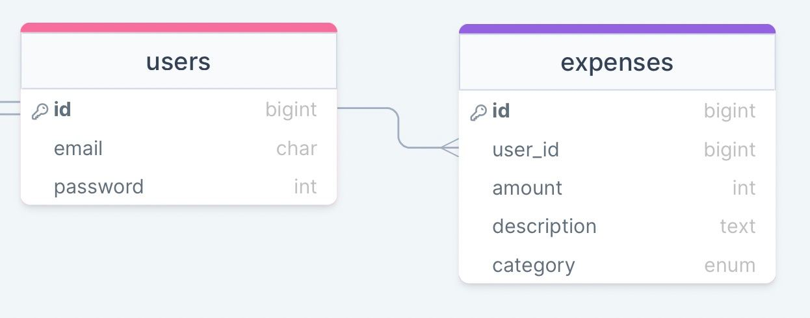

# Faster Than Light task

## Used technologies:

### Backend part:
- `esbuild`
- ruby '3.1.2'
- gem 'rails', '~> 7.0.4'
- gem 'pg', '~> 1.1'
- gem 'rspec-rails', '~> 5.1', '>= 5.1.2'
- gem 'shoulda-matchers', '~> 5.0'
- gem 'factory_bot_rails', '~> 6.2'
- gem 'faker', '~> 2.23'

### Frontend part:
- CSS - [tailwindCss](https://tailwindcss.com)
- Component library - [daisyUI](https://daisyui.com)

## How to run project:
1. Clone the repo:
```shell
git clone git@github.com:tumophiy/ftl-task.git
```
2. Install dependencies if you don't have it:
```shell
npm i daisyui
```
3. Install gems:
```shell
bundle install
```
4. Create and migrate database:
```shell
rails db:create
rails db:migrate
```
10. Because I used `esbuild` in this project in order to run it you have to use command:
```shell
./bin/dev
```

### Structure of db:

- Amount, name are required fields for expenses table
- Description is optional

Things you may want to cover:
* Configuration
* Database initialization
* How to run the test suite
* Deployment instructions
