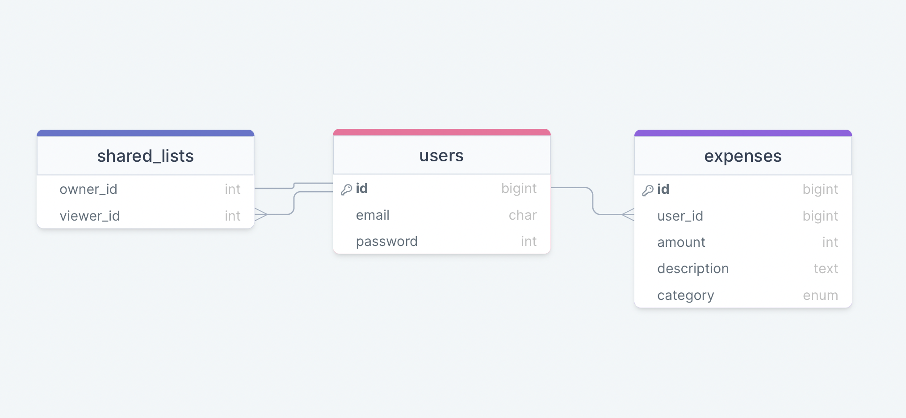

# Faster Than Light task

## Used technologies:

### Backend part:
- `esbuild`
- ruby '3.1.2'
- gem 'rails', '~> 7.0.4'
- gem 'pg', '~> 1.1'
- gem 'rspec-rails', '~> 5.1', '>= 5.1.2'
- gem 'shoulda-matchers', '~> 5.0'
- gem 'factory_bot_rails', '~> 6.2'
- gem 'faker', '~> 2.23'

### Frontend part:
- CSS - [tailwindCss](https://tailwindcss.com)
- Component library - [daisyUI](https://daisyui.com)

## How to run project:
1. Clone the repo:
```shell
git clone git@github.com:tumophiy/ftl-task.git
```
2. Install dependencies if you don't have it:
```shell
npm i daisyui
```
3. Install gems:
```shell
bundle install
```
4. Create and migrate database:
```shell
rails db:create
rails db:migrate
```
10. Because I used `esbuild` in this project in order to run it you have to use command:
```shell
./bin/dev
```

### Structure of db:

- Amount, name are required fields for expenses table
- Description is optional

### Thoughts
- CRUD operation for expenses are working but `select_tag` doesn't save info. I googled this but wasn't able to find the solution (
- I tried hard to use stimulus for filters, yet failed to do that. It works for some parts but not as expected. The filters appear after you add records accordingly. If you only have 2 categories filter would have 2 states. Also it should be possible to select multiple filters at once, but (
- I think that my idea for sharing lists is elegant. The idea is in additional table, model and controller. So user would be able to input email and respectful friend will see the list that you shared. This table holds 2 ID's because viewer and owner of list theoretically can change the email, so grabbing the ID's is more solidly.
